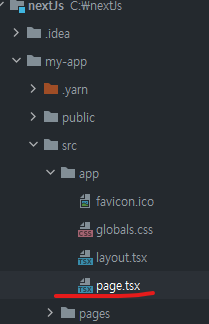
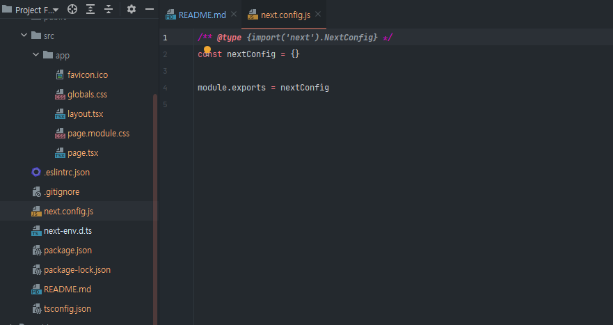
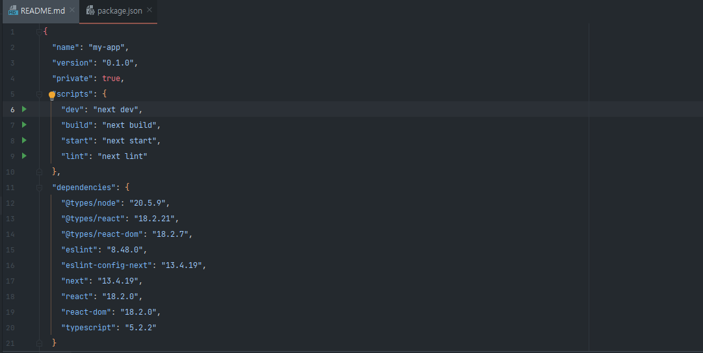
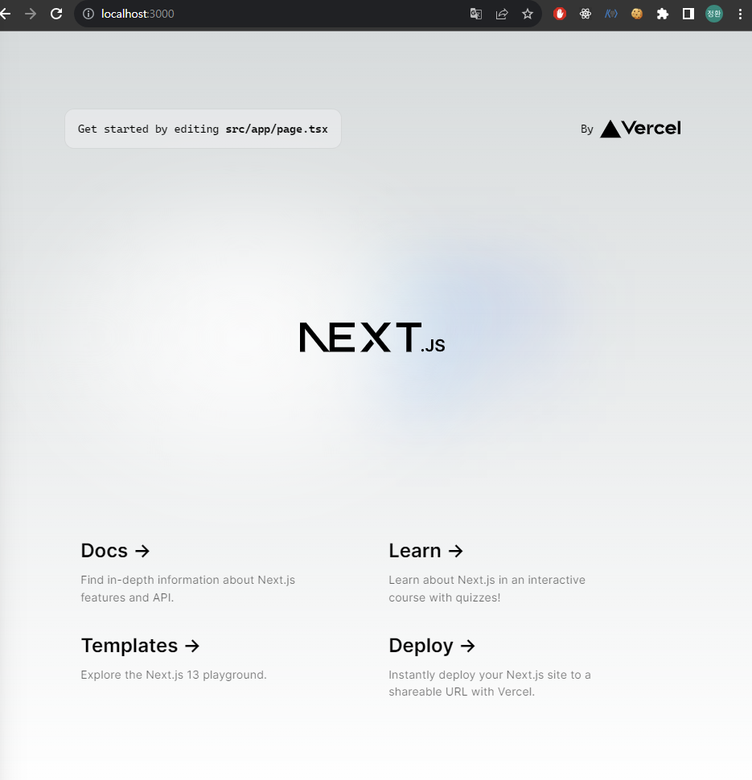

# Next JS 기초
## Next Js란??
웹 계발을 위한 **리액트 프레임워크**이다.  
React를 기반으로 웹 어플리케이션을 만드는데 필요한 전체적인 도구들을 제공해준다.  
* Full-Stack(Frontend,Backend)
* File-base routing
* Optimization(파일,이미,폰트 최적화)
* SSR 뿐만 아니라 다양한 하이브리드 렌더링 가능
  
### Next.js의 6가지 원칙
1. 복잡한 설정을 하지 않아도 손쉽게 프레임워크를 사용
2. 자바스크립트 만으로 모든것을 해결
3. 자동으로 code-splitting 과 서버랜더링 지원
   1. code-splitting: 우리가 작성한 코드를 전부 사용자에게 전달하는 것이 아니라 현재 사용자가 보고있는 페이지의 코드만 부분적으로 잘라서 사용자에게 전달
4. data-fetching 설정가능
5. 요청사항을 예상을 예측한다.
6. 배포를 손쉽게!

## 발전 과정 
* 2016년 git 허브 오픈소스 프로젝트로 공개(2015년 창립된 **Vercel**이라는 회사)
  * Vercel: 미국 클라우드 회사로서 **Pass** 제공
  * Vercel 에서 제공하는 Pass를 이용하면 Next.js로 만든 웹앱 배포 및 관리가 쉬움
* 2023.09 : v9.3
  * Rewrite, reDirect, Incremental Static Generation 추가
* 2022.10: v13
  * new Routing
  * layouts
  * Server Components
  * streaming
  * new toolchain(Turbopack: 번들링 툴)

## Rendering
### CSR(Client Side Rendering)
렌더링 하는 주체자가 클라이언트(브라우저)  
1. 클라이언트 측에서 서버로 요청을 하면 빈 html파일을 전달
2. React 라이브러리 파일과 JS 파일(소스코드) 전달
3. React 라이브러리가 실행하면서 root요소에 우리가 작성한 JS파일(컴포넌트)를 연결하면서 DOM 요소로 변환
  
#### 즉 사용자에게 화면을 보여주기 위해서 브라우저가 서버로부터 HTML,UI 라이브러리,JS 파일등을 다운받아서 클라이언트측에서 다운로드 받은 소스를 바탕으로 DOM요소로 변환하여 표기한다.  
  
### 장점
1. 한번 로딩 되면, 빠른 UX 제공
2. 서버의 부하가 작음
### 단점
1. 페이지 로딩 시간(TTV: Time to View)이 길다 -> FCP(First Contentful Paint) 시간이 길다
2. 자바스크립트 활성화 필수
   1. 사용자가 브라우저의 자바스크립트를 비활성화 하면 동작하지 않는다.(기본적으로 UI 요소가 HTML에 없기 때문)
3. SEO 최적화가 힘듬
4. 보안에 취약함
   1. 모든 코드들이 클라이언트측으로 넘어가야 하기때문
5. CDN에 캐시가 안됨
   1. CDN(Content Deliver Network): 사용자와 원본 서버 사이의 물리적 거리를 줄여 콘텐츠 로딩에 소요되는 시간을 최소화하는 기술
      1. CDN은 전 세계에 분산된 서버 네트워크를 사용합니다. 사용자의 요청이 들어오면 가장 가까운 CDN 서버가 콘텐츠를 전달합니다. 이로써 사용자는 원본 서버에서 콘텐츠를 직접 다운로드하지 않아도 되므로, 콘텐츠 로딩 속도가 향상됩니다.
  
#### 이러한 문제점을 해결하기 위해서 나온 렌더링 방식이 SSG, SSR 이다.
  
### SSG(Static Site Generation)
렌더링 하는 주체자가 서버,렌더링 시점은 빌드할때 렌더링  
다른 렌더링과의 차이점은 **렌더링 하는 시점** ,즉 언제 렌더링을 할 것이냐에 따라 달라진다.  
  
어플리케이션을 실행하기전, 빌드하는 시점에 우리가 작성한 코드를 실행하면서 React 코드를 HTML로 변환(렌더링)한다.  
이떄, 해당 화면이 DB에서 데이터를 읽어와서 화면을 만든다면 이러한 작업들도 같이 수행한다.  
#### 즉 브라우저 화면에 어떻게 표기할 HTML 파일을 빌드할때 생성한다.   
Static Site Generation이란 정적인 사이트를 만드는 것을 말한다.  
클라이언트 측에서 특정 페이지를 요청하면 서버는 빌드때 생성했던 html파일을 브라우저에게 전달한다.  
  
### 장점
1. 페이지 로딩시간(TTV)이 빠름
2. 자바스크립트 필요 없음
3. SEO 최적화가 좋음
4. 보안이 뛰어남
5. CDN에 캐시가 됨
### 단점
1. 데이터가 정적임
2. 사용자별 정보 제공의 어려움

#### 이러한 문제점을 해결하기 위해서 나온 렌더링 방식이 ISR, SSR 이다.

### ISR(Incremental Static Regeneration)
렌더링 하는 주체자가 서버,여전히 정적인 화면을 만들지만 이때 렌더링을 주기적으로 렌더링을 한다.  
SSG가 빌드할때 렌더링을 한다면 ISR은 우리가 설정한 주기 만큼 페이지를 계속해서 렌더링한다.  
예를들어 주기가 5분이라면 처음 빌드한 이후에 5분마다 새로운 페이지를 만든다.  
#### 즉, SSG와 동일한 원리이지만 정해진 주기에 따라 페이지를 다시 생성한다. 
  
### 장점
1. 페이지 로딩시간(TTV)이 빠름
2. 자바스크립트 필요 없음
3. SEO 최적화가 좋음
4. 보안이 뛰어남
5. CDN에 캐시가 됨
6. **데이터가 주기적으로 업데이트됨**
### 단점
1. 실시간 데이터가 아님
2. 사용자별 정보 제공의 어려움

#### 이러한 문제점을 해결하기 위해서 나온 렌더링 방식이 SSR 이다.
  
### SSR(Server Side Rendering)
렌더링하는 주체가 서버, 렌더링 시점은 요청시 렌더링!!  
클라이언트 에서 특정 페이지를 요청하면 서버에서는 요청시점에 html파일을 만들어서 클라이언트측에게 전달한다.  
  
### 장점
1. 페이지 로딩 시간이 빠름
2. 자바스크립트 필요 없음
3. SEO 최적화 좋음
4. 보안이 뛰어남
5. 실시간 데이터를 사용
6. 사용자별 필요한 데이터를 사용함
### 단점
1. 비교적 느림
2. 서버의 과부화가 거릴 수 있음 -> 서버에 overhead가 높아진다라고도 한다.
3. CDN에 캐시가 안됨
  
  
## 하이브리드 렌더링(Hybrid Rendering)
> Hybrid 사전적 의미  
> 특정 목적을 달성하기 위해 두개 이상의 기능이나 요소를 결합  
  
그러면 웹 어플리케이션에서의 하이브리드란 무엇일까??  
특정 목적 이란 웹 어플리케이션에서는 보다 성능이 좋은 사이트를 의미할 것이고  
두개 이상의 기능은 앞에서 살펴본 여러가지의 렌더링 방법이될 수 있을 것이다.  
  
### 즉, Next.js를 사용하면 여러 렌더링 방식을 혼합하여 보다 성능이 좋은 웹 어플리케이션을 만들 수 있다.
  
예를들어 특정 사이트의 홈화면은 ISR로, 소개 페이지는 SSG로 사용자의 상세 페이지는 SSR/CSR를 이용하는 등  
한 어플리케이션에서 페이지별로 가장 최적화된 렌더링방식을 선택하여 만들어 나갈 수 있다.  
또한, 한페이지에서도 부분벼롤 다른 렌더링 방식을 혼합하여 하이브리드 형식으로 사용할 수 있다.  
  
## Hydration(하이드레이션)
> Hydration : 수화시키다  
> 물로 가득채우다.  
  
Next.js에서 하이드레이션이라 하면은 React로 가득채우다(Neaxt.js는 React 프레임워크이다.)  
  
클라이언트 측에서 서버로 특정화면을 요청하면 Next.js는 필요한 작업(데이터베이스에서 데이터를 읽어옴등)과 함께 페이지를 만든다.  
이때 만들어진 페이지는 **정적인 HTML 페이지**이다. 그리고 이러한 정적인 페이지를 만드는 작업을 **pre-rendering**이라고 말한다.  
사용자가 빠르게 페이지를 볼 수 있도록 pre-rendering 된 정적인 HTML 페이지를 클리언트에게 먼저 전달한다.  
  
그러면 클라이언트는 먼저 빠르게 해당페이지를 사용자에게 보여줄 수 있다.  
그러나 이때 이 HTML 페이지에는 Javascript 코드가 포함되어 있지 않기때문에 사용자가 여러 event를 발생시켜도 동작하지 않는다.  
  
그 뒤에 UI 라이브러리(React),JS코드를 전달해주고 클라이언트 측에서 HTML,라이브러리, JS 코드를 모두 다운로드하면  
그다음에 React로 Hydration을 한다.  
#### 즉, 브라우저에서 모든 필요한 소스를 다운로드 받은 후에 컴포넌트로 렌더링을 진행한다.  
1. 사용자에게 정적인 HTML을 먼저 보내준다.
2. 렌더링에 필요한 라이브러리와 JS 소스코드를 전달한다.
3. 클라이언트에서 필요한 라이브러리 와 소스코드를 다운받은 후에 정적인 페이지 대신에 페이지에 컴포넌트를 렌더링한다.
  
#### 핵심은 정적인 페이지에서 하이드레이션이 진행되는 이 간격을 줄여나가는게 포인트이다.


### 설치
```
npx create-next-app@latest 

yarn create next-app 
>특정 버전 yarn add next@13.1.6(버전)
pnpm create next-app
```

## 구조
  
next.js 프로젝트를 다운로드 받으면 이렇게 app 이라는 디렉토리 안에 있는 page.tsx 파일이 있는데  
이 페이지가 index.html 과 같이 가장 첫 페이지가 된다.


* next.config.js
    * next 관련 설정파일


* dev
    * 개발할때 쓰는 개발용 모드
* build
    * 프로젝트 빌드 사용 명령어
* start
    * 배포뒤 실핼할때 사용
* lint
    * 소스코드 검사할때 사용

  
기본 실행화면  
  
    
## 라우팅
[Next.js 라우팅](./page/README.md)  
  
## 렌더링
1. [Next.js 렌더링](./rendering/README.md)  
2. [UI 컴포넌트](./ui/README.md)
  
## API 라우터
[Next.js 렌더링](./rendering/route/README.md)  

## 에러
next.js 에서  
`Error: Cannot find module 'tailwindcss'`  
해당 에러가 발생했을때  
1. npm uninstall autoprefixer postcss tailwindcss
   1. 먼저 postcss를 제거한후에
2. [테일윈드 공식사이트](https://tailwindcss.com/docs/guides/nextjs)의 설치 방법을 따라 재성치한다.
