# 라우팅
## Next.js 버전 12
  
pages 디렉토리 안에 about.tsx 파일을 생성하였다. 그다음 브라우저 기본경로 다음에 /about URI를 추가하면  
  
위와 같이 자동으로 라우팅되서 우리가 만든 컴포넌트가 화면에 보여지는 것을 확인할 수 있다.  
  
  
이뿐만 아니라 중첩된 경로역시 손쉽게 라우팅이 가능하다.  
  
경로에 products 라고 입력하기만하면 products 디렉토리 안에 있는 index 파일이 자동으로 렌더링이 된다.  
  
기본적으로 pages 디렉토리 안에 하위 디렉토리안에 있는 index파일이 기본적으로 렌더링되고  
그 경로의 하위경로들은 우리가 만든 파일명으로 렌더링 된다.  
  
이처럼 Next.js를 사용하면 파일별로 라우팅이 자동으로 설정되는데 이를 **file base routing**이라고 한다.  
### 따라서 Next.js 를 사용하게되면 원하는 경로에 컴포넌트를 만들기만하면 자동으로 라우팅 설정이된다.

## Next.js 버전 13
그렇다면 왜 기존 pages 폴더안에서 파일을 생성하는 방식의 라우팅방식을 사용하지 않고  
app 이라는 경로를 만들게 되었을까??  
경로별로 새로운 컴포넌트의 페이지가 모두 렌더링이 되어서 화면에 노출되게 된다.  
특정 컴포넌트는 고정한 상태로 원하는 화면만 렌더링을하고 싶은데 이러한 부분에 기존 next.js 에서 문제점이 있었고  
이러한 부분들을 개선과 이전 버전과의 호환성을 생각해서 새로운 경로인 app이 생겨났다.  
  
###13버전부터는 app경로 안에 page라는 파일을 만들면 자동으로 라우팅이 된다.
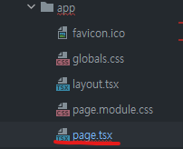  
13버전 이후에는 app 이라는 경로안에 라우팅을 원하는 폴더를 생성하고  
그안에 page라는 파일을 생성하면 된다.  
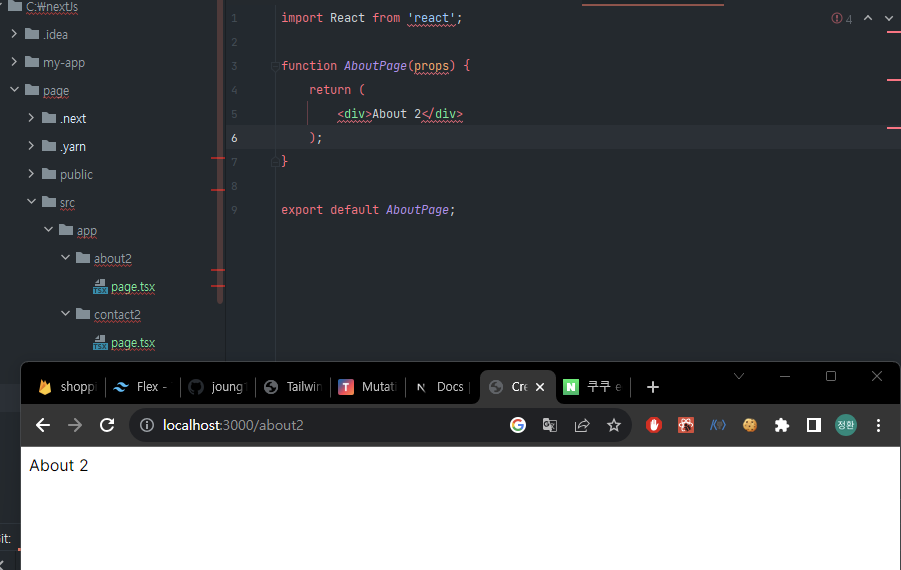  

  
#### 이렇게 특정 부모 라웉밍 안에서 재사용 가능한 컴포넌트를 지정하고 해당 라우팅안에서 에러나 복잡한 로직등을 처리하기 위해서 폴더 안에 page 파일이 생겨나게 되었다.
  
  
중첩 경로  
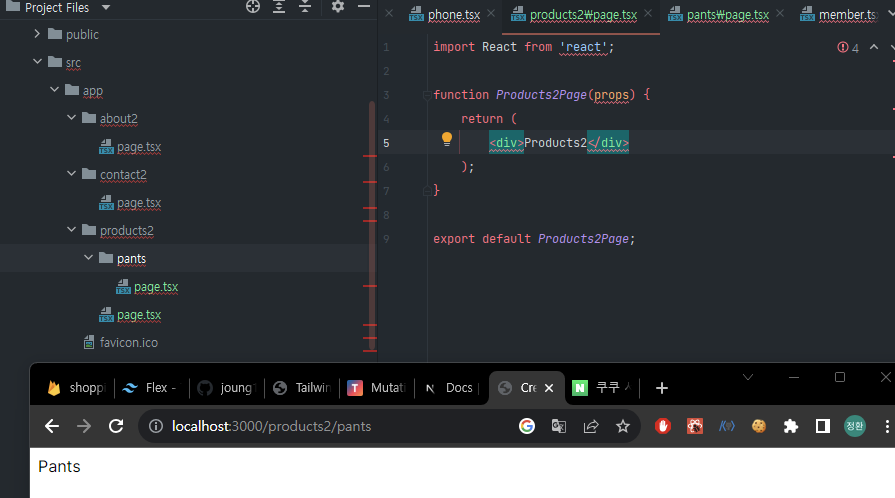

## build
이렇게 next.js를 이용해서 라우팅을 한다음에 브라우저 창에 경로를 입력하면 생각보다 화면이 느리게 보여지는 것을 확인할 수 있는데  
그 이유는 `dev 모드`에서는 클라이언트(브라우저)에서 요청하면  
그해당 하는 페이지를 컴파일링해서 랜더링한후 페이지가 업데이트가 되기때문이다.
### dev 모드에서는 요청할때 페이지를 새롭게 만든다.
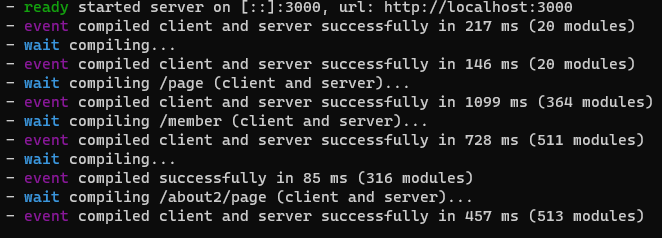  
따라서 yarn build, npm run build 명령어를 통해 build를 하게 되면  
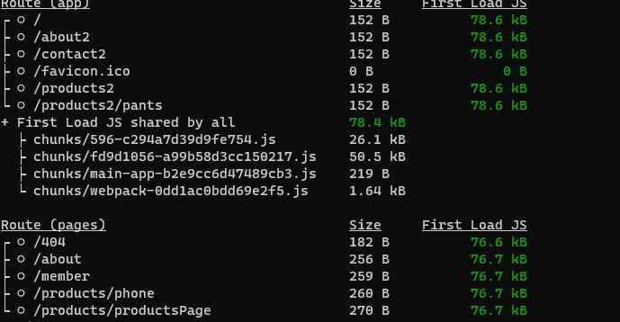  
이런식으로 라우팅 정보와 어떤 페이지가 정적인 페이지인지 아닌지 알 수 있다.
  
> 오류  
> yarn build  
> Type error: Cannot find module 'next/dist/lib/metadata/types/metadata-interface.js' or its corresponding type declarations.  
> 
> 프로젝트에서 npm install을 진행한후 npm build로 해결 
  
> 오류2  
> Type error: Parameter 'props' implicitly has an 'any' type.  
> npm build 시 타입스크립트 에러 발생  
> props에 :any 타입을 명시적으로 지정해서 해결

# 동적 라우팅
static 라우팅이 아닌 동적으로 라우팅을 진행하기 위해서는 next.js 에게 `[]`해당 키워드를 이용해서 동적라우팅임을 명시해 줘야한다.  
즉, 우리가 build 했을때 고정된 html 파일이 아니라 전체적인 틀은 고정되어있고 특정 키워드에 따라 특정 부분만을 변경하고 싶을때 사용한다.
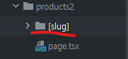  
`[]`대괄호 안에 키워드는 어떤 값이 오던지 상관없다. 이렇게 동적인 라우팅을 사용하겠다는 `[]` 키워드를 지정해 주면  
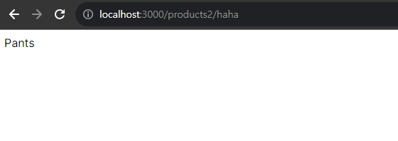    
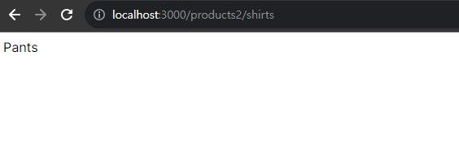  
위의 사진처럼 `/products2/`뒤에 어떤 uri값과 상관없이 라우팅이 되는 것을 확인할 수 있다.  
하지만 이때 어떤 경로로 접근했는지를 모른다면 우리가 원하는 라우팅과는 조금 다른 결과일 것이다.  
따라서 컴포넌트 안에서 우리가 어떤 경로로 접근했는지 확인하는 방법은 **너무나 간단하다.**  
Next.js 에서 해당 접근 경로를 컴포넌트의 props로 전달해 주기 때문이다.  
```
import React from 'react';

type Props = {
    params: {
        slug: string;/*만약 동적라우팅이 [item]이라면 itemn:string;*/
    }
}

function PantsPage({params}: Props) {
    return (
        <div>{params.slug} 제품 설명을 해볼까나??</div>
    );
}

export default PantsPage;
```
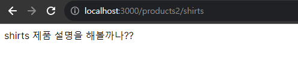  
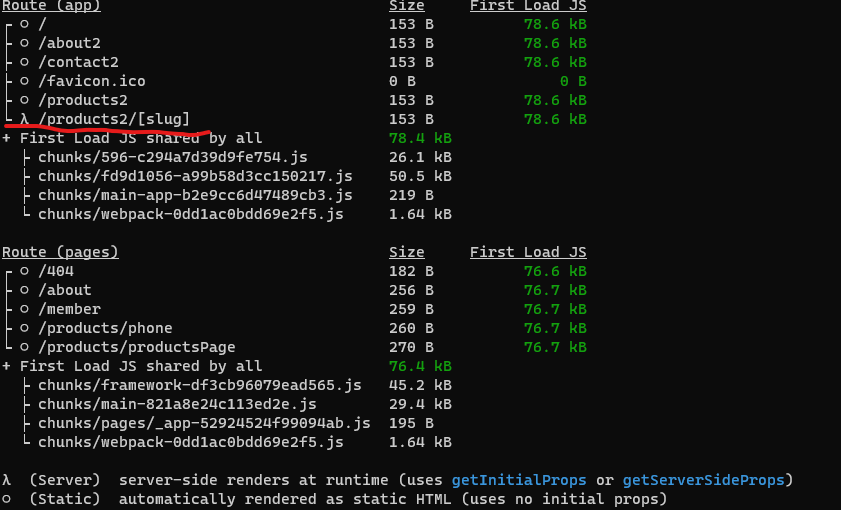  
build를 한곳을 보면 /product2 경로뒤에는 동적으로 페이지를 생성하기때문에 정적인 페이지가 만들어 지지 않는 것을 볼 수 있다.  
  
그러면 동적라우팅에서 특정한 페이지만을 미리 만들 수는 없을까??  
예를 들어 특정 상품을 10개정도만 미리 정적이 페이지로 만들거나 사용자가 가장 많이 구매하는 상품등을 미리 만드는 방법은 없을까??  
  
## 페이지 미리생성
다이나믹 페이지를 적용한 컴포넌트안에서 어떤 페이지를 미리 만들어 둘것인지 명시해주면 된다.  
```
import React from 'react';

type Props = {
    params: {
        slug: string;
    }
}

function PantsPage({params}: Props) {
    return (
        <div>{params.slug} 제품 설명을 해볼까나??</div>
    );
}

export function generateStaticParams() {/*Next.js 규격함수명*/
    const products = ['pants','shirts'];
    return products.map(product => ({slug:product,}));
}

export default PantsPage;
```  

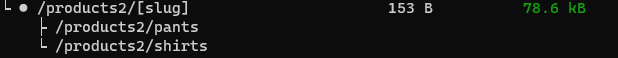  
이렇게 `generateStaticParams`함수를 사용해서 특정 경로의 페이지를 미리 만들 수 있는 것을 확인할 수 있다.  
  
### 정리
다이나믹 라우트를 사용하는 컴포넌트를 빌드하게 되면 이 `[slug]`페이지는 빌드시에 static 하게 만들어진다.  
### 이말은 기본 골격은 HTML로 만들고 특정 경로로 접근하게되면 next.js 서버에서 우리가 만든 컴포넌트의 props로 경로를 전달해 준다.  
이때 `generateStaticParams`함수를 사용하게되면 경로를 props로 전달한 다음에 함수에서 명시된 경로의 페이지를 미리 만든다.
  
### 추가
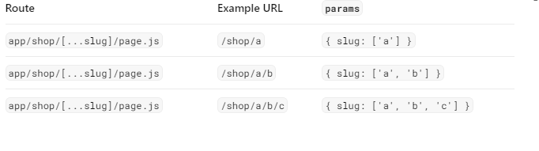  
단일 경로 뿐만아니라 동적 라우팅에서 중첩 경로 역시 표현이 가능한데 이때는 `shop/[...slug]` 이런식으로 표현할 수 있다.  
이렇게 표현하면 위에 그림처럼 shop 이후에 오는 중첩경로들 역시도 동적으로 라우팅할 수 있다.  

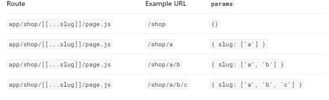  
대괄호를 두번 사용하게되면 선택적으로 경로를 라우팅할 수 있다.  
직 특정 경로가 없다면 기본적인 경로를 라우팅하고 경로가 있다면 동적라우팅을 한다.


## next.js 에서 라우팅 구조
1. page.js : 라우트에 해당하는 기본 UI
2. layout.js : 재사용 가능한 UI를 생성,내부 상태를 기억
   1. template.js : layout.js 와 유사하지만, 내부 상태를 기억X
3. loading.js
4. error.js
5. not-found.js  
  
## 라우팅 그룹
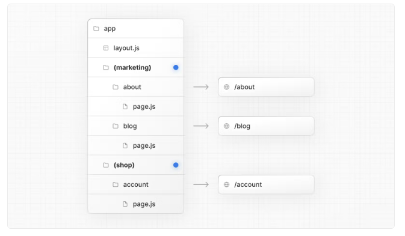  
위에서 `(marketing)` 경로는 실질적으로 라우팅에는 영향을 주지 않지만 그 하위 경로인 about 과 blog 를 하나의 그룹으로 묶기위한  
논리적인 구분이다.

