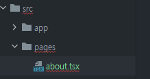
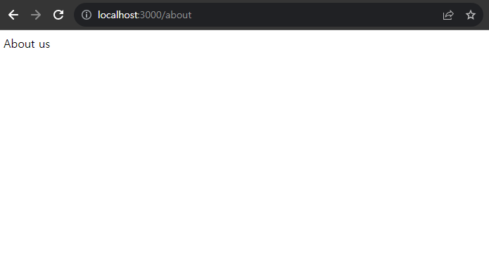
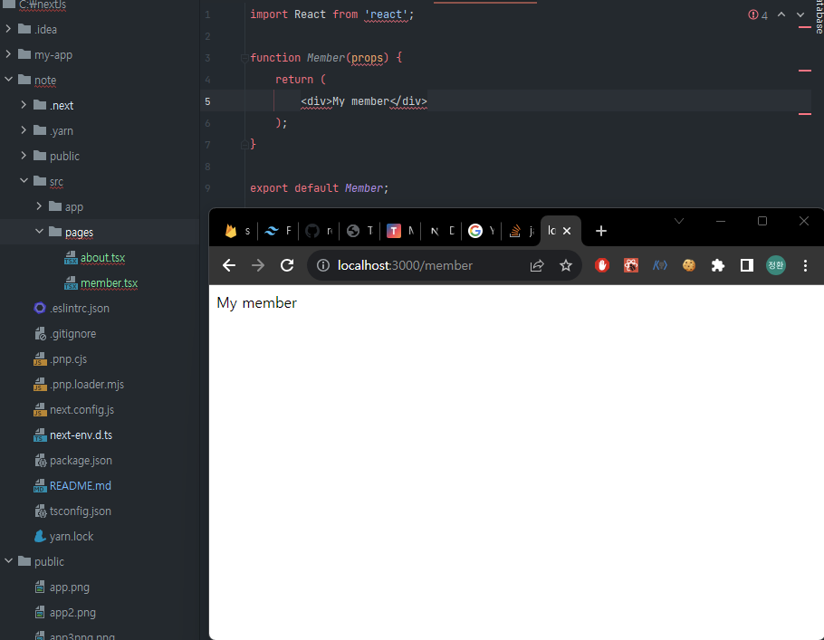
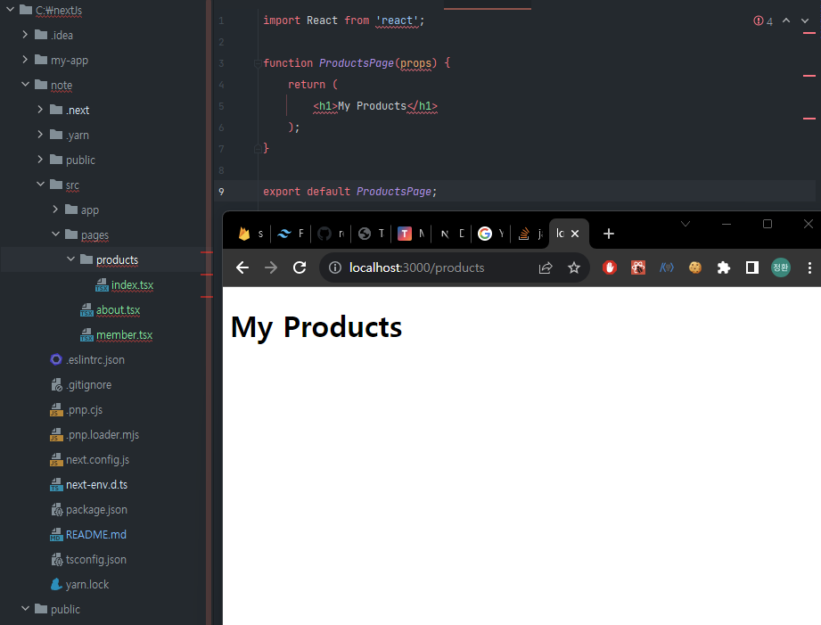
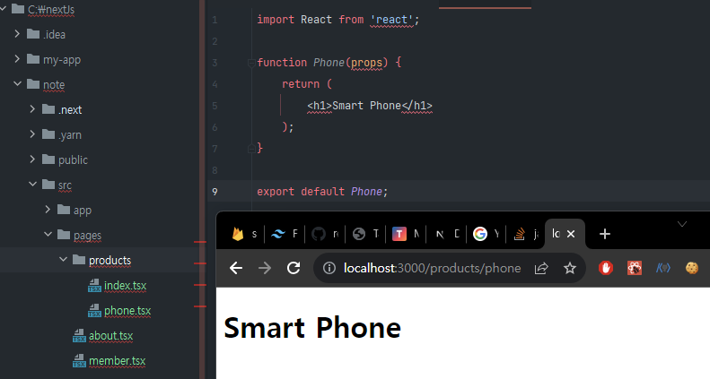

# 라우팅
## Next.js 버전 12
  
pages 디렉토리 안에 about.tsx 파일을 생성하였다. 그다음 브라우저 기본경로 다음에 /about URI를 추가하면  
  
위와 같이 자동으로 라우팅되서 우리가 만든 컴포넌트가 화면에 보여지는 것을 확인할 수 있다.  
  
  
이뿐만 아니라 중첩된 경로역시 손쉽게 라우팅이 가능하다.  
  
경로에 products 라고 입력하기만하면 products 디렉토리 안에 있는 index 파일이 자동으로 렌더링이 된다.  
  
기본적으로 pages 디렉토리 안에 하위 디렉토리안에 있는 index파일이 기본적으로 렌더링되고  
그 경로의 하위경로들은 우리가 만든 파일명으로 렌더링 된다.  
  
### 따라서 Next.js 를 사용하게되면 원하는 경로에 컴포넌트를 만들기만하면 자동으로 라우팅 설정이된다.