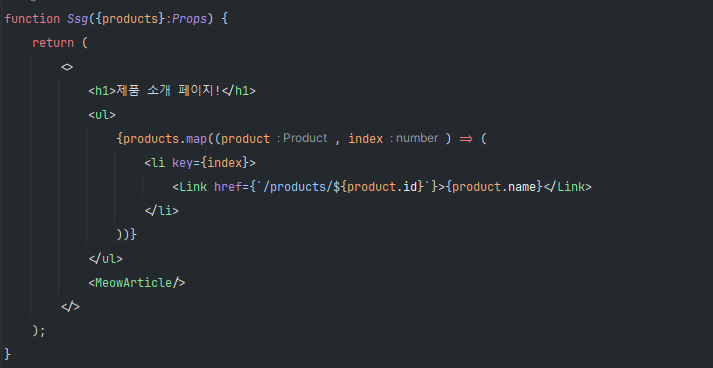
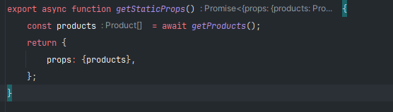
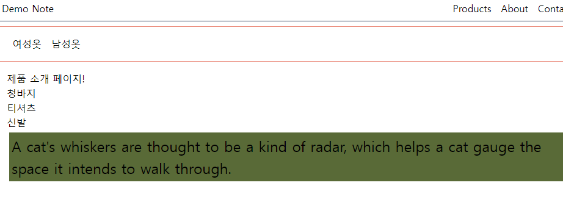

# V12 vs V13
## V12
페이지 단위로 렌더링 방식을 규정하였다.  
그래서 `getStaticProps()`를 사용하면 SSG(Static Site Generation)    
`getServerSideProps()`를 사용하면 SSR(Server Side Rendering),  
즉 어떤 함수를 사용함에 따라 렌더링 방식을 결정할 수 있었다.  
`getStaticProps()` 함수에서 특정 주기를 설정하여  
페이지를 계속 렌더링하게 만들어 ISR(Incremental Static Regeneration)를 사용할 수도 있었다.  

#### 이 모든 것들이 페이지 단위로 규정되어 있었다.  

### SSG
```
import React from 'react';
import {getProducts, Product} from "@/service/products/products";
import Link from "next/link";
import MeowArticle from "@/components/article/MeowArticle";

type Props = {
    products: Product[];
}

function Ssg({products}:Props) {
    return (
        <>
            <h1>제품 소개 페이지!</h1>
            <ul>
                {products.map((product, index) => (
                    <li key={index}>
                        <Link href={`/products/${product.id}`}>{product.name}</Link>
                    </li>
                ))}
            </ul>
            <MeowArticle/>
        </>
    );
}

export async function getStaticProps() {
    const products = await getProducts();
    return {
        props: {products},
        revalidate:10,
    };
}

export default Ssg;
```
  
V12에서는 Client Side Component 나 Server Component를 구분할 필요 없이  
  
해당 코드부분이 Client Side에서 실행이 될것이고
  
위의 코드와 같이 `getStaticProps`같은 Next.js에서 제공하는 함수들은 Server에서 실행된다.  
  
#### 즉 V12 에서는 Component는 Clinet Side에서 동작하고 Next.js에서 제공하는 함수들은 서버에서 동작한다. 이때 Server Fetching한 데이터를 Component에 전달하고 싶다면 props형태로 전달한다. 
  
  
### SSR
SSR 렌더링은 Component를 만드는 로직은 동일하지만 props를 전달하는 next.js 함수만 달라진다.  


  
## V13
페이지 단위로 특정 렌더링 방식을 규정하는 것이 아니라  
`Server Component`,`Client Component`라는 개념이 도입되었다.  
React.js에서 18전 이후부터  Next.js 와 같이 SSR이 가능한 프레임워크를 위해서 `Server Component` 라는 개념을 추가하였다.  
> Server Component  
> 서버 상에서만 동작하는 컴포넌트
  
### 컴포넌트 단위로 렌더링 방식을 규정  
한 페이지 안에서도 `Server Component`,`Client Component` 혼합하여 보다 효율적으로 웹페이지를 구성할 수 있게 되었다.  
  
# Server Component
app 디렉토리 안에 있는 Component는 기본적으로 모두 Server Component 이다.  
이를 확인하기 위해서 간단하게 `console.log`로 확인이 가능하다.  
```
import Image from 'next/image';
import styles from './page.module.css';


export default function Home() {
  console.log('Hello!');
  return <h1>홈페이지다!!</h1>;
}
```
`Hello`가 브라우저 콘솔창에 나오면 브라우저에서 서버에서 나오면 서버에서 실행되는지 알 수 있다.  
  
우리가 출력한 `Hello`가 터미널에서 컴파일되면서 출력되는 것을 확인할 수 있다.  
**즉, Server Component는 서버에서 실행이된다. 따라서 우리가 작성한 Component코드는 서버에서 실행되어(build) HTML 형태로 브라우저에게 전달된다. 그래서 우리가 작성한 console.log 코드는 브라우저에서 출력이 되지 않는다.**  
  
또한, **서버에서 동작하기 때문에 브라우저에서 제공하는 API는 사용할 수 없다. 대신 Node 환경에서 제공하는 노드 API를 사용할 수 있다.**  
노드 API 확인하기  
```
import os from 'os';  // 노드APIS

export default function Home() {
  console.log('Hello!');
  console.log(os.hostname())
  return <h1>홈페이지다!!</h1>;
}
```
  
  
**서버에서 동작하기때문에 브라우저에서 동작하는데 필요한 상태관리등은 Server Component에서는 불가능하다.**  
```
import os from 'os';// 노드APIS
import {useState} from "react";  

export default function Home() {
  console.log('Hello!');
  console.log(os.hostname())
  const [name, setName] = useState('');
  return <h1>홈페이지다!!</h1>;
}
```  
  
  
### 그래서 Next.js를 사용할때는 Server Component 와 Client Component의 차이점과 각각 Component에서 할 수 있는 것과 없는 것을 명확하게 인지해야한다.
  
# Client Component
Server Component는 서버에서 동작하기 때문에 브라우저에서 발생하는 일,  
예를들어, 사용자의 클릭을 처리,상태 값,useEffect(),useState(), useReducer()등 브라우저에서만 할 수 있는 일은 Server Component에서는 할 수 없다.  
  
그래서 **우리가 사용자의 Event를 처리한다는 등 이러한 작업을 처리하기 위해서 Client Component를 만들어야한다.**  
이때 페이지 전체를 Client Component로 만든다면 Next.js를 사용하는 의미가 없어진다.  
즉, 정말 필요한 부분만을 Client Component로 만들어서 사용해야한다.  
예를 들면 특정 Event를 처리하는 부분만을 Client Component로 만들어야 한다.  
  
app 디렉토리 안에서 Client Component들을 관리할 수 있지만 별도로 여기서는 별도로 `components`디렉토리를 만들어서 관리할 것이다.  
  
```
'use client';
import React, {useState} from 'react';
function Counter() {
    const [count, setCount] = useState(0);
    return (
        <>
        </>
    );
}
export default Counter;
```
기본적으로는 Server Component 이기 때문에 Next.js에게 해당 Component는 Client Component라고 명시('use client') 해주어야 한다.  

# 동작 원리
  
빌드시 진행되는 메세지를 확인해 보면 ServerComponent와 Client Component 모두 출력되는 것을 확인할 수 있다.  
근데 왜 Client Component가 서버에서 실행되었을까??  
  
처음로 다운받은 정적인 페이지를 확인해보면 우리가 만든 Client Component도 포함되어 있는 것을 확인할 수 있는데  
이는 Client Component는 무조건 Client Side Rendering이 된다는 말이 아니다.  
즉, **브라우저에서 처리해야하는 코드를 Client Component라고 하고 이 작성된 코드가 Client에 보내지는게 Client Component라고 파악할 수 있다.**  
  
처음으로 받아온 이 정적인 HTML 페이지에는 Client Component안에 있는 정적인 데이터가 포함되어 있지만  
  
이 HTML 상에서 click 이벤트는 처리되지 않는 것을 확인할 수 있다.  
Next.js에서 자체적으로 Component를 하나하나 확인하면서 HTML 파일로 만들 수 있는 부분을 HTML 파일로 만든다.  
그렇기 때문에 Build 시에 Client Component가 실행된 것이다.  
이렇게 먼저 브라우저에게 정적인 HTML파일 먼저 전달한 다음에 이벤트가 처리되기 위해서는 `Hydration`이 일어나야 한다.  
정적인 HTML 페이지만으로는 이벤트를 처리할 수 없기때문에 그뒤에 실행하기위해 필요한 React 및 JS 파일이 다운로드 받아진뒤  
실행이 되어서 실제로 Component로 렌더링이 되어야지(React Component로 Hydration)만 브라우저에서 Click 이벤트를 처리할 수 있다.  
  
  
**13버전 이후에서는 페이지 전체 코드가 Client측으로 가는 것이 아니라 Server Component는 서버상에서 실행된 상태로 있고  
Client Component의 코드만 Client측으로 보내진다.**  
그렇기 때문에 실제 번들링된 JS코드의 양이 줄어 들게 된다.  
> 12버전에서는 페이지단위로 처리
  
### 추가
React 18버전 이전에는 Server Component가 지원되지 않았기 때문에  
Next.js 에서는 **페이지**단위로 미리 렌더링을 진행하여 생성된 HTML 파일을 client 측으로 전달하고 Hydration이 진행된다.  
이러한 방식은 client측에서 전달해야하는 Javascript 코드가 증가하게되서 번들링하는데 있어서 문제를 발생시켰다.  
  
## ISR 렌더링
기본적으로는 SSG로 동작하지만 revalidate 키워드를 추가하면 ISR 렌더링을 할 수 있다.  
page.js 나 layout.js 에서  
```
export const revalidate = 3600 // revalidate at most every hour
                              // 0초면 SSR처럼 요청이 올때마다 렌더링
```
키워드를 추가하면 된다.  
이렇게 추가한 다음에 파일의 값을 변경해보면  
  
  
3초뒤에 데이터가 변경된 것을 확인할 수 있다.  
이처럼 revalidate를 사용하면 특정한 주기마다 렌더링을 다시 수행하는 것을 확인할 수 있다.  
  
## SSG
우리의 서버외에 다른 API를 이용해서 데이터를 가공해야하는 경우가 상당히 비번하게 발생한다.  
이때  
```
const res = await fetch('https://meowfacts.herokuapp.com/');
const data = await res.json();
const factText = data.data[0];
```
이와 같이 API를 이용해서 데이터를 받아와서 화면에 보여주고 싶다.
  
하지만 이때 해당 화면에서 새로고침을해도 항상같은 데이터만 보여주고 있는데  
이는 build할때 해당 API가 호출되고 그 이후에는 호출되지 않기때문이다(SSG).  
  
## ISR
따라서 fetch 할때 revalidate 옵션을 추가해서 특정 주기마다 새롭게 호출하도록 변경해야한다.  
```
const res = await fetch('https://meowfacts.herokuapp.com/',{next:{revalidate:3}});
```
이렇게 지정해주면 Next.js 에서 자동으로 해당 렌더링을 ISR로 변경해준다.  
  
## SSR
이때 revalidate 를 0으로 하게되면 요청할때마다 화면을 다시 만들어서 내려주는 SSR방식으로 작동한다.  
혹은  
```
const res = await fetch('https://meowfacts.herokuapp.com/',{cache:'no-store'});
```
`cache:'no-store'`옵션도 SSR처럼 작동한다.


## CSR
우리가 fetch해서 데이터를 가져오는데 해당 정보가 SSG라면 해당 정보가 변경되지 않고  
그렇다고 SSR으로 만들자니 서버에 과부화를 줄 것 같다.  
이럴때 페이지에 있기는 하지만 중요도가 다른 컨텐츠에 보다 중요도가 낮은 경우  
즉, 나중에 렌더링 되도 상관 없는 경우 이런한 부분을 CSR로 만들면 보다 효율적인 웹 어플리케이션을 만들 수 있다.  
즉, 사용자가 방문했을때 그때 데이터를 받아오고 싶다면 해당 로직이 서버 컴포넌트에서 동작하면 안된다.  
```
'use client';
import React, {useEffect, useState} from 'react';
import styles from "./MeowArticle.module.css";

async function Article() {
    const [text, setText] = useState('');
    useEffect(() => {
        const res = fetch('https://meowfacts.herokuapp.com')
            .then(res => res.json())
            .then(data => {
                setText(data.data[0])
            });
    }, []);


    return (
        <article className={styles.article}>{text}</article>
    );
}

export default MeowArticle;
```  
  
## 정리
[Data Fetching 공식문서](https://nextjs.org/docs/app/building-your-application/data-fetching)  
데이터 Fetching을 서버에서 진행하는 것을 Next.js 공식 사이트에서는 추천하고 있다.  
그 이유는  
1. Backend resources(ex DB)에 직접적으로 접근할 수 있다.
2. 토큰이나 API Key 와 같은 보안에 민감한 데이터를 Client쪽에 노출시키지 않을 수 있다.
3. 데이터를 Fetching 하는 것과 렌더링을 동일 환경에서 처리할 수 있다.
4. client 측에서 화면을 만들기위해 여러번 서버측에 요청할 필요가 없다.
5. 서버와 데이터가 동일한 곳에 있기때문에 성능적인 측면에서 보다 효율적이다.  
  
또한 동일한 layout 안에서 동일한 fetch가 여러번 발생하는 경우 Neaxt.js에서 자동적으로 중복을 제거해준다.  
단, Post 요청에 대해서는 자동으로 중복제거를 해주지 않는다.


