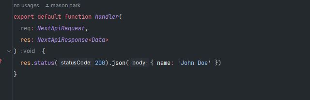
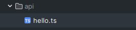
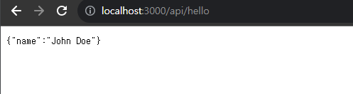

# API 라우터
V12 에서 page 디렉토리 안에 v13버전 이후는 app 디렉토리안에 api라는 디렉토리가 존재한다.  
React를 이용해서 front-end를 개발하고 있는데 별도로 서버를 가지고 있지는 않다.  
하지만 Next.js 를 이용하면 front-end 뿐만아니라 back-end 작업도 할 수 있다고 했는데 이를 가능하게 하는 것이 이 api 디렉토리 이다.  

  
이러한 함수를 Vercel에 등록만하면  
  
해당 경로로 요청이 들어오면 우리가 등록한 함수가 호출되여 마치 서버처럼 동작한다.  
  
  
## 구조
```
export default function handler(
  req: NextApiRequest,
  res: NextApiResponse<Data>
) {
  res.status(200).json({name: 'John Doe'});
}
```
  
우리가 등록한 **handler**함수를 보면 파라미터로  
* req
  * client에서 보낸 요청에 관한 정보를 가지고 있다
    * NextApiRequest
      * HTTP 요청의 모든 정보를 포함하고 있으며, 이를 통해 개발자는 요청의 메서드, URL, 헤더, 바디 등을 확인하고 처리할 수 있습니다.
      * 속성:
        * method: HTTP 메서드
        * url: 요청 URL
        * headers: HTTP 헤더
        * query: URL 쿼리 파라미터
        * body: 요청 바디
      * ```
        // 요청 메서드 확인
        const method = req.method;  
        // 요청 URL 확인
        const url = req.url;
        // HTTP 헤더 확인
        const headers = req.headers;
        // URL 쿼리 파라미터 확인
        const query = req.query;
        // 요청 바디 확인
        const body = req.body;
        ```
* res
  * 결과 값을 반환할 수 있는 res 가 있다.
  * NextApiResponse<Data>
    * HTTP 응답의 모든 정보를 포함하고 있으며, 이를 통해 개발자는 응답의 상태 코드, 헤더, 바디 등을 설정할 수 있습니다.
    * 속성:
      * status: HTTP 상태 코드
      * headers: HTTP 헤더
      * body: 응답 바디
    * ```
      // 응답 상태 코드 설정
      res.status(200);
      // HTTP 헤더 설정
      res.setHeader('Content-Type', 'application/json');
      // 응답 바디 설정
      res.json({
        message: 'Hello, World!',
      });
      ```