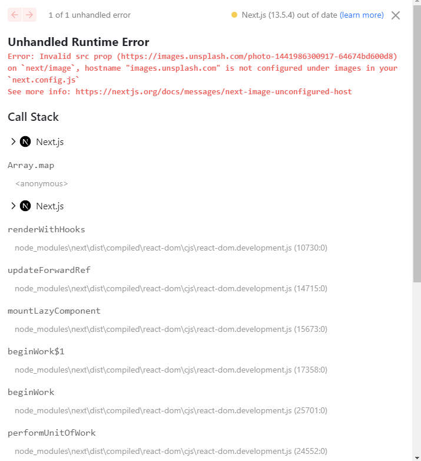

## loading.js
13버전 이후부터는 app 디렉토리 안에 특정안 파일을 만듬으로써 그경로에 접근했을 때  
보이는 화면이나 not-found와 관련된 페이지 및 API 관련 파일까지 알아보았다.  
이번에는 loading이라는 파일을 통해서 간단하게 loading UI에 대해서 확인해 보자.  
  
기본적으로 loading.js 특정한 작업이 완료되기 전까지 사용자에게 **준비중이다**라는 메세지를 화면상에 보여주는 UI 컴포넌트이다.  
사용법은 내가 원하는 경로에서 사용하고 loading.js(jsx),ts(tsx) 파일을 만들면 된다.  
  
해당 파일을 생성한후에 브라우저에서 확인해보면 우리가 적용한 Loading 컴포넌트가 정상적으로 작동하는 것을 확인할 수 있다.  
우리가 앞서 만든 layout 안에 있는 page가 Loading 컴포넌트로 대체되어 있는 것을 확인할 수 있다.  
  
  
### 확인점
`npm run dev` 와 같이 개발 모두에서는 모두 SSR 처럼 동작하지만 기본적으로 SSG 페이지 이기때문에 차이점이 존재한다.  
실제 build를 한후에 확인해 보면 SSG는 이미 서버에서 HTML 파일을 만들어서 전달해주기 때문에 크게 의미가 없는 것을 확인할 수 있다.  
  
### 동작 원리
next.js는 loading.js를 이용해서 손쉽게 Loading UI를 만들 수 있는 기본적으로는 React Suspense 처럼 작동한다.  
>[React Suspense](https://react.dev/reference/react/Suspense)는 특정 컴포넌트들을 불러올때 그 시간동안 우리가 지정한 Loading UI를 보여주는 Wrapper Component 이다.  
  
이렇게 전체적인 UI는 사용자에게 먼저 보여주고 시간이 오래걸리는 컴포넌트들은 먼저 Loading UI를 보여주고  
해당 컴포넌트가 load되면 Loading UI 대신 해당 컴포넌트들을 보여준다.  
  
원하는 경로에 load.js를 만들어두면 Next.js 자체적으로 해당 경로의 페이지를 `<Suspens>` 컴포넌트로 감싼다.  
  
출처: https://nextjs.org/  
  
이렇게 layout 전체를 감싸서 사용할 수 도 있고 내부적으로 `<Suspend>` 컴퍼넌트를 별도로 사용하며 하위 컴포넌트들에게도 적용할 수 있다.  
따라서 특정 데이터를 병렬적으로 fetching 해올때 병렬적으로 처리하는 각각의 컴포넌트 마다 다른 Loading을 보여주는 것도 간으하다.  
  
병렬처리 예시
```
import Albums from './albums'
 
async function getArtist(username: string) {
  const res = await fetch(`https://api.example.com/artist/${username}`)
  return res.json()
}
 
async function getArtistAlbums(username: string) {
  const res = await fetch(`https://api.example.com/artist/${username}/albums`)
  return res.json()
}
 
export default async function Page({
  params: { username },
}: {
  params: { username: string }
}) {
  // Initiate both requests in parallel
  const artistData = getArtist(username)
  const albumsData = getArtistAlbums(username)
 
  // Wait for the promises to resolve
  const [artist, albums] = await Promise.all([artistData, albumsData])
 
  return (
    <>
      <h1>{artist.name}</h1>
      <Albums list={albums}></Albums>
    </>
  )
}
```
데이터를 받아올때 각각의 데이터를 병렬적으로 처리하고 마지막에 Promise.all을 통해서 병렬처리가 모두 완료시까지 기다렸다가 return 한다.  


`<Suspend>` 사용예시
```
import { Suspense } from 'react'
import { PostFeed, Weather } from './Components'
 
export default function Posts() {
  return (
    <section>
      <Suspense fallback={<p>Loading feed...</p>}>
        <PostFeed />
      </Suspense>
      <Suspense fallback={<p>Loading weather...</p>}>
        <Weather />
      </Suspense>
    </section>
  )
}
```

이렇게 병렬처리 `<Suspend>`컴포넌트를 이용해서  
```
// ...
 
async function Playlists({ artistID }: { artistID: string }) {
  // Wait for the playlists
  const playlists = await getArtistPlaylists(artistID)
 
  return (
    <ul>
      {playlists.map((playlist) => (
        <li key={playlist.id}>{playlist.name}</li>
      ))}
    </ul>
  )
}
 
export default async function Page({
  params: { username },
}: {
  params: { username: string }
}) {
  // Wait for the artist
  const artist = await getArtist(username)
 
  return (
    <>
      <h1>{artist.name}</h1>
      <Suspense fallback={<div>Loading...</div>}>
        <Playlists artistID={artist.id} />
      </Suspense>
    </>
  )
}
```
이처럼 빠르게 먼저 처리될 수 있는 부분을 먼저 UI에 노출하고 `<h1>{artist.name}</h1>`  
처리가 오래걸리는 부분을 `Suspend`컴퍼넌트를 통해서 Loading UI를 노출함으로써 사용자가 좀더 유의미한 페이지를 볼 수 있도록 도와준다.  


## error.js
error.js는 기본적으로 `React Error Boundary`를 이용해서 동작한다.  
>[React Error Boundary](https://react.dev/reference/react/Component#catching-rendering-errors-with-an-error-boundary)는 자식 컴포넌트에서 발생되는 에러를 **catch**하여 특정 UI 메세지를 제공해준다.
  
이 error.js 에도 loading.js 와 유사하게 특정 라우터 별로 error 를 표기할 수 있는 UI 컴퍼넌트 이다.
  
출처:https://nextjs.org/  
  

  
사용: 이떄 반드시 Client Component 로 만들어야한다.
```
'use client' // Error components must be Client Components
 
import { useEffect } from 'react'
 
export default function Error({
  error,
  reset,
}: {
  error: Error & { digest?: string }
  reset: () => void
}) {
  useEffect(() => {
    // Log the error to an error reporting service
    console.error(error)
  }, [error])
 
  return (
    <div>
      <h2>Something went wrong!</h2>
      <button
        onClick={
          // Attempt to recover by trying to re-render the segment
          () => reset()
        }
      >
        Try again
      </button>
    </div>
  )
}
```
  
이떄 Error 컴퍼넌트 파라미터로 에러 메세지와 페이지를 다시 reset할 수 있는 callback 함수를 전달 받는다.  
  

### 동작원리
내부적으로 `React Error Boundary`를 이용해서 해당 컴퍼넌트를 감싸면서 동작하고 있다.  
  
출처:https://nextjs.org/  

또한 loading.js 와 마찬가지로 `<Error Boundary>` 컴퍼넌트를 이용해서 직접 정의할 수 있다.  
  
### 참고  
만약 하위 라우터에서 에러가 정의되지 않았다면 그 상위경로로 이동해서 error.js가 정의되어 있는지를 찾아 올라간다.  
따라서 가장 근접한 곳의 error.js를 보여주고 없다면 그 상위 error.js를 찾아 올라간다 
  
  
## 이미지  
### 프로젝트 서버에 있는 이미지
프로젝트 내에서 이미지를 사용할때 next.js 에서 html 이미지 테그를 사용하는 것이 아니라  
next.js에서 제공하는 `<Image>` 컴퍼넌트를 사용하면 된다.  
사용하는 방법은 이미지 테그를 사용하는 것과 동일히다.  
이때 사용할때 경로를 사용해도 되지만 이미지를 static 하게 import해서 사용하는 것이 더 좋다.  
```
import Image from "next/image";
import clothImage from '../../../public/images/clothes.jpg';

<Image src={clothImage} alt='Clothes'/>

```
실제 화면에서 표시되는 이미지테그 정보를 확인해보면 실제 우리가 프로젝트에서 가지고 있는 파일크기가 더 크다는 것을 알 수 있다.  
또한  
```

```
이미지 정보를 확인해보면 화면 사이즈별로 사진이 최적화 되어 있는 것을 알 수 있다.
  
  
#### 즉, 일반 이미지 테그를 사용하는 것보다 사진 크기나 사이즈 별렬로 최적화하는 작업등 next.js 이미지 컴퍼넌트가 자동으로 이미지 리소스를 최적화 해준다.
  
  
### 다른 서버에 있는 이미지(URL)
```
<Image src='https://images.unsplash.com/photo-1441986300917-64674bd600d8' alt='shop'/>
```
  
이런식으로 오류가 발생하는 것을 확인할 수 있는데 이런식으로 URL을 사용하는 경우에는 `with` 프로퍼티가 사용해야한다고 나온다.  
```
            <Image src='https://images.unsplash.com/photo-1441986300917-64674bd600d8'
                   alt='shop'
                   width={400}
            />
```
width 프로퍼티를 추가하고 확인해보면  
  
Invalid src prop 이라고 여전히 오류가 나오는 것을 확인할 수 있다.  
이렇게 외부 소스를 사용하기 위해서는 next.config.js 에 등록을 해줘야 한다.  
```
const nextConfig = {
    images: {
        remotePatterns: [
            {
                protocol: 'https',
                hostname: 'images.unsplash.com',

            }
        ]
    }
}
```
추가적으로 한페이지에 이미지가 여러 개 있으면 이미지 렌더링하는 우선순위를 지정해 줄 수 있는다.  
```
            <Image src='https://images.unsplash.com/photo-1441986300917-64674bd600d8'
                   alt='shop'
                   width={400}
                   priority // 우선순위
            />
```
### 정리
next.js 에서 제공해주는 `Image` 컴퍼넌트를 사용하면 이미지 최적화 뿐만 아니라  
이미지 사이즈를 지정해주면 지정한 공간만큼 미리 html에 만들어 두기때문에 이미지가 다운로드되기전과 다운로드된 후에  
이미지가 차지하는 공간이 변하지 않기때문에 이러한 사이즈변화로 발생하는 layout shift가 발생하지 않는다.  
#### 즉 불필요하게 html을 다시 렌더링하지 않는다.
  
## 폰트
next.js 에서는 자동적으로 폰트 최적화를 해준다.  
이는 self-hoisting 방식으로 폰트 파일을 제공하고 내부적으로 CSS size-adjust 를 사용한다. 이를 통해서 layout shift 발생을 방지한다.  
예를 들어 구글 폰트를 사용한다면 빌드 시간에 해당 CSS 와 폰트 파일을 다운로드 받은후에   
self-hosted 방식으로 static하게 지원하기 때문에 브라우저에서 구글로 요청을 보낼 필요가 없다.  
사용법:  
```
import { Inter } from 'next/font/google'
 
// If loading a variable font, you don't need to specify the font weight
const inter = Inter({
  subsets: ['latin'],
  display: 'swap',
})
 
export default function RootLayout({
  children,
}: {
  children: React.ReactNode
}) {
  return (
    <html lang="en" className={inter.className}>
      <body>{children}</body>
    </html>
  )
}
```

```
import { Roboto } from 'next/font/google'
 
const roboto = Roboto({
  weight: '400',
  subsets: ['latin'],
  display: 'swap',
})
 
export default function RootLayout({
  children,
}: {
  children: React.ReactNode
}) {
  return (
    <html lang="en" className={roboto.className}>
      <body>{children}</body>
    </html>
  )
}
```
[next.js 폰트 공식사이트](https://nextjs.org/docs/app/building-your-application/optimizing/fonts)

## Redirect
로그인을 안한 사용자를 로그인 페이지로 이동시킨다는 것과 같이 특정 페이지로 보내는 것을 말하는데  
next.js 에서는 next.config.js 파일을 통해서 이를 간단하게 설정할 수 있다.  
```
/** @type {import('next').NextConfig} */
const nextConfig = {
    async redirects() {
        return [
            {
                source: '/products/deleted_forever',
                destination:'/products',
                permanent:true,
            },
            {
                source: '/products/deleted_tmp',
                destination:'/products',
                permanent:false,
            }
        ]
    },
}

module.exports = nextConfig

```
우리가 redirect 배열을 return 해주면 된다.  
>redirects()  
> 함수는 배열 형태로 리디렉션 규칙을 반환합니다. 각 규칙은 `source`와 `destination`, 그리고 `permanent` 프로퍼티로 구성됩니다.  
> - `source`: 원래의 URL 경로를 나타냅니다.
> - `destination`: 리디렉션 후 이동할 URL 경로를 나타냅니다.
> - `permanent`: 리디렉션의 유형을 나타내며, `true`이면 영구 리디렉션(301 Redirect)을 의미하고, `false`이면 일시적인 리디렉션(302 Redirect)을 의미합니다.


## Rewrite 
URL에 보안상에 민감한 Key나 복잡한 URL을 다른 URL로 대체할 수 있게 해준다.  
```
module.exports = {
  async rewrites() {
    return [
      {
        source: '/about',
        destination: '/',
      },
     {
        source: '/mason',
        destination: '/about/me/mason',
      },
      {
        source: '/items/:slug',
        destination: '/products/:slug',
      },
    ]
  },
}
```
  
이렇게 실제 경로는 `/about/me/mason` 이지만 외부에 노출되는 URL을 Rewrites에 설정한 URL로 대체할 수 있다.  
  
## 동적 Redirect
만약 로그인을 안한 사용자가 내정보 와 같은 페이지에 접근했을때 로그인 여부를 판단해서 로그인 하지 않았다면 로그인 페이지로 이동하거나  
또는 존재 하지 않는 제품 코드로 접근한 사용자를 전체 상품 페이지로 이동시키는 등 과 같이 동적으로 사용자를 이동시키기 위해서는  
next.js 에서 제공하는 `redirect` 함수를 사용하면 된다.
```
export default async function ProductPage({params: {slug}}: Props) {
    const product = await getProduct(slug);
    if (!product) {
        redirect('/경로');
    }
    return (
        <>
        ....
        <GoProductsButton/>
        </>
    );
}
```
  
  
### 확인사항
만약 되돌오간 페이지에 다른 페이지로 이동하는 버튼을 만들고싶다.  
하지만 서버 컴퍼넌트에서는 이벤트 처리를 할 수 없기 때문에 해당 부분을 클라이언트 컴퍼넌트로 만들어서 처리해야된다.  
```
'use client';
import React from 'react';
import {useRouter} from "next/navigation";

function GoProductsButton() {
    const router = useRouter();
    return (
        <button onClick={() => {router.push('/products')}}>제품 페이지</button>
    );
}
```

## 미들웨어
우리가 어떤 페이지에 접근할때 공통적으로 처리하는 로직이 있다면  
이 로직을 모든 로직마다 수행하는 것은 너무 비효율적이다.  
따라서 이러한 공통으로 처리되어야 하는 로직이 있다면  
공통으로 추출하여 모든 로직을 접근하기전에 문지기처럼 미들웨어 역할을 하게 만들 수 있다.  
이 미들웨어는 src 폴더 최상위, 또는 src를 사용하지 않는다면 프로젝트 최상위에 위치해야 한다.  
  
```
import {NextRequest} from "next/server";

export function middleware(request:NextRequest) {
    console.log('미들웨어가 검사중..');
    //.... 로직
}
```
```
import { NextResponse } from 'next/server'
import type { NextRequest } from 'next/server'
 
// This function can be marked `async` if using `await` inside
export function middleware(request: NextRequest) {
  return NextResponse.redirect(new URL('/home', request.url))
}
 
// See "Matching Paths" below to learn more
export const config = {
  matcher: '/about/:path*',
}
```
 
  
  
하지만 이 미들웨어는 전체 페이제에서 수행되어지기 때문에 특정한 페이지에서만 수행하고 싶다면 config 객체를 통해 이를 설정할 수 있다.  
```
export const config = {
  matcher: ['/about/:path*', '/dashboard/:path+'],
}
/*
:path* : path가 있거나(많거나) 없거나 둘 다 가능
:path+ : path가 하나 또는 많거나
*/
```

[미들웨어 공식문서](https://nextjs.org/docs/app/building-your-application/routing/middleware)