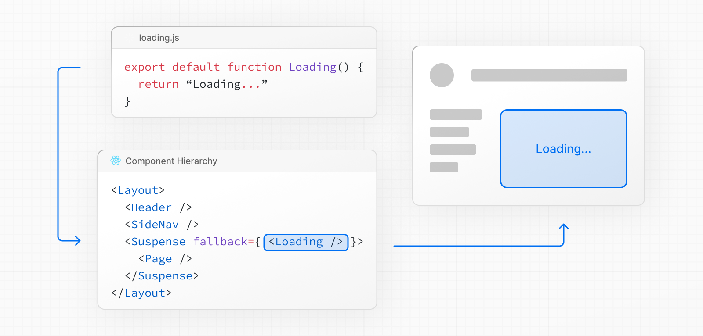

## loading.js
13버전 이후부터는 app 디렉토리 안에 특정안 파일을 만듬으로써 그경로에 접근했을 때  
보이는 화면이나 not-found와 관련된 페이지 및 API 관련 파일까지 알아보았다.  
이번에는 loading이라는 파일을 통해서 간단하게 loading UI에 대해서 확인해 보자.  
  
기본적으로 loading.js 특정한 작업이 완료되기 전까지 사용자에게 **준비중이다**라는 메세지를 화면상에 보여주는 UI 컴포넌트이다.  
사용법은 내가 원하는 경로에서 사용하고 loading.js(jsx),ts(tsx) 파일을 만들면 된다.  
  
해당 파일을 생성한후에 브라우저에서 확인해보면 우리가 적용한 Loading 컴포넌트가 정상적으로 작동하는 것을 확인할 수 있다.  
우리가 앞서 만든 layout 안에 있는 page가 Loading 컴포넌트로 대체되어 있는 것을 확인할 수 있다.  
  
  
### 확인점
`npm run dev` 와 같이 개발 모두에서는 모두 SSR 처럼 동작하지만 기본적으로 SSG 페이지 이기때문에 차이점이 존재한다.  
실제 build를 한후에 확인해 보면 SSG는 이미 서버에서 HTML 파일을 만들어서 전달해주기 때문에 크게 의미가 없는 것을 확인할 수 있다.  
  
### 동작 원리
next.js는 loading.js를 이용해서 손쉽게 Loading UI를 만들 수 있는 기본적으로는 React Suspense 처럼 작동한다.  
>[React Suspense](https://react.dev/reference/react/Suspense)는 특정 컴포넌트들을 불러올때 그 시간동안 우리가 지정한 Loading UI를 보여주는 Wrapper Component 이다.  
  
이렇게 전체적인 UI는 사용자에게 먼저 보여주고 시간이 오래걸리는 컴포넌트들은 먼저 Loading UI를 보여주고  
해당 컴포넌트가 load되면 Loading UI 대신 해당 컴포넌트들을 보여준다.  
  
원하는 경로에 load.js를 만들어두면 Next.js 자체적으로 해당 경로의 페이지를 `<Suspens>` 컴포넌트로 감싼다.  
  
출처: https://nextjs.org/  
  
이렇게 layout 전체를 감싸서 사용할 수 도 있고 내부적으로 `<Suspend>` 컴퍼넌트를 별도로 사용하며 하위 컴포넌트들에게도 적용할 수 있다.  
따라서 특정 데이터를 병렬적으로 fetching 해올때 병렬적으로 처리하는 각각의 컴포넌트 마다 다른 Loading을 보여주는 것도 간으하다.  
  
병렬처리 예시
```
import Albums from './albums'
 
async function getArtist(username: string) {
  const res = await fetch(`https://api.example.com/artist/${username}`)
  return res.json()
}
 
async function getArtistAlbums(username: string) {
  const res = await fetch(`https://api.example.com/artist/${username}/albums`)
  return res.json()
}
 
export default async function Page({
  params: { username },
}: {
  params: { username: string }
}) {
  // Initiate both requests in parallel
  const artistData = getArtist(username)
  const albumsData = getArtistAlbums(username)
 
  // Wait for the promises to resolve
  const [artist, albums] = await Promise.all([artistData, albumsData])
 
  return (
    <>
      <h1>{artist.name}</h1>
      <Albums list={albums}></Albums>
    </>
  )
}
```
데이터를 받아올때 각각의 데이터를 병렬적으로 처리하고 마지막에 Promise.all을 통해서 병렬처리가 모두 완료시까지 기다렸다가 return 한다.  


`<Suspend>` 사용예시
```
import { Suspense } from 'react'
import { PostFeed, Weather } from './Components'
 
export default function Posts() {
  return (
    <section>
      <Suspense fallback={<p>Loading feed...</p>}>
        <PostFeed />
      </Suspense>
      <Suspense fallback={<p>Loading weather...</p>}>
        <Weather />
      </Suspense>
    </section>
  )
}
```

이렇게 병렬처리 `<Suspend>`컴포넌트를 이용해서  
```
// ...
 
async function Playlists({ artistID }: { artistID: string }) {
  // Wait for the playlists
  const playlists = await getArtistPlaylists(artistID)
 
  return (
    <ul>
      {playlists.map((playlist) => (
        <li key={playlist.id}>{playlist.name}</li>
      ))}
    </ul>
  )
}
 
export default async function Page({
  params: { username },
}: {
  params: { username: string }
}) {
  // Wait for the artist
  const artist = await getArtist(username)
 
  return (
    <>
      <h1>{artist.name}</h1>
      <Suspense fallback={<div>Loading...</div>}>
        <Playlists artistID={artist.id} />
      </Suspense>
    </>
  )
}
```
이처럼 빠르게 먼저 처리될 수 있는 부분을 먼저 UI에 노출하고 `<h1>{artist.name}</h1>`  
처리가 오래걸리는 부분을 `Suspend`컴퍼넌트를 통해서 Loading UI를 노출함으로써 사용자가 좀더 유의미한 페이지를 볼 수 있도록 도와준다.  


## error.js
error.js는 기본적으로 `React Error Boundary`를 이용해서 동작한다.  
>[React Error Boundary](https://react.dev/reference/react/Component#catching-rendering-errors-with-an-error-boundary)는 자식 컴포넌트에서 발생되는 에러를 **catch**하여 특정 UI 메세지를 제공해준다.
  
이 error.js 에도 loading.js 와 유사하게 특정 라우터 별로 error 를 표기할 수 있는 UI 컴퍼넌트 이다.
  
출처:https://nextjs.org/  
  

  
사용: 이떄 반드시 Client Component 로 만들어야한다.
```
'use client' // Error components must be Client Components
 
import { useEffect } from 'react'
 
export default function Error({
  error,
  reset,
}: {
  error: Error & { digest?: string }
  reset: () => void
}) {
  useEffect(() => {
    // Log the error to an error reporting service
    console.error(error)
  }, [error])
 
  return (
    <div>
      <h2>Something went wrong!</h2>
      <button
        onClick={
          // Attempt to recover by trying to re-render the segment
          () => reset()
        }
      >
        Try again
      </button>
    </div>
  )
}
```
  
이떄 Error 컴퍼넌트 파라미터로 에러 메세지와 페이지를 다시 reset할 수 있는 callback 함수를 전달 받는다.  
  

### 동작원리
내부적으로 `React Error Boundary`를 이용해서 해당 컴퍼넌트를 감싸면서 동작하고 있다.  
  
출처:https://nextjs.org/  

또한 loading.js 와 마찬가지로 `<Error Boundary>` 컴퍼넌트를 이용해서 직접 정의할 수 있다.  
  
### 참고  
만약 하위 라우터에서 에러가 정의되지 않았다면 그 상위경로로 이동해서 error.js가 정의되어 있는지를 찾아 올라간다.  
따라서 가장 근접한 곳의 error.js를 보여주고 없다면 그 상위 error.js를 찾아 올라간다 
